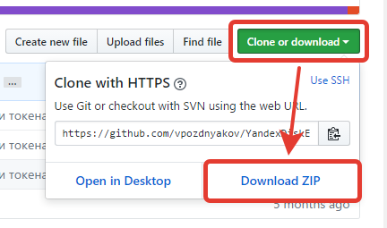
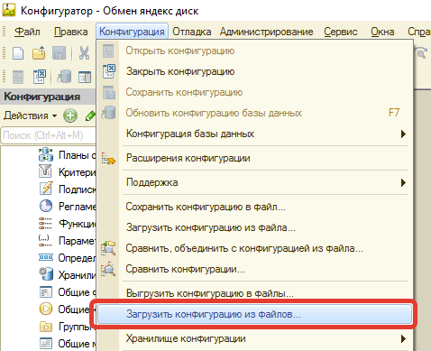
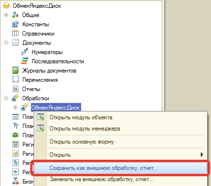

# Экспорт проекта во внешнюю обработку EPF
1. Откройте главную страницу проекта https://github.com/vpozdnyakov/YandexDiskExchangeXML
2. Нажмите "Clone or download" — "Download ZIP".

3. Распакуйте архив в любое место.
4. Откройте в конфигураторе пустую базу и нажмите "Конфигурация" — "Загрузить конфигурацию из файлов...".

5. Укажите путь к папке YandexDiskExchangeXML с файлом Configuration.xml, выполните загрузку конфигурации.
6. Найдите в конфиграции обработку ОбменЯндексДиск, щелкните правой кнопкой и выберите "Сохранить как внешнюю обработку, отчет..."

